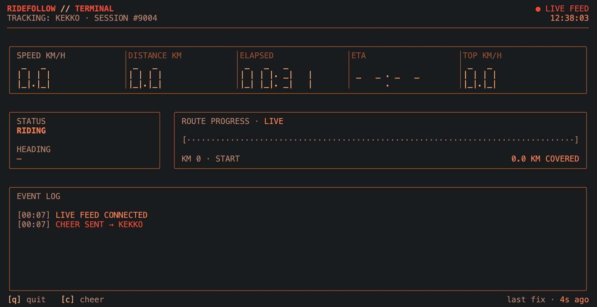

# ridefollow

Follow a live [RideFollow](https://ridefollow.live) bike ride from your terminal.
Someone shares a private link from the RideFollow app — you paste it here and
watch their ride unfold on a green-phosphor CRT dashboard, like race day:
speed, distance, ETA, route progress and a live event feed.



(The headline metrics render as glowing seven-segment "LCD" digits; the wordmark's
`//` and the progress arrow carry the RideFollow flame accent.)

## Install

**npm** (no install — just run it):

```sh
npx ridefollow "https://ridefollow.live/?ride=<token>"
```

or install it globally:

```sh
npm install -g ridefollow
ridefollow "https://ridefollow.live/?ride=<token>"
```

**Homebrew**:

```sh
brew install ridefollow/tap/ridefollow
ridefollow "https://ridefollow.live/?ride=<token>"
```

Requires Node.js 18+ (Homebrew pulls it in automatically).

## Usage

```
ridefollow <share-link | token>
```

You can paste the whole share link, just the `host/?ride=…` part, or the bare
token — they all work.

| Option | | Description |
| --- | --- | --- |
| `-n, --name <name>` | | Name shown on a cheer you send (env `RIDEFOLLOW_NAME`) |
| `--api <url>` | | Override the control-plane API base (env `RIDEFOLLOW_API`) |
| `--insecure` | | Skip TLS certificate verification — dev brokers only |
| `-h, --help` | | Show help |
| `-v, --version` | | Print the version |

### While watching

| Key | Action |
| --- | --- |
| `q` / `Esc` | Quit |
| `c` | Send a cheer to the rider 📣 |

Piping the output somewhere that isn't a terminal (a file, a log, CI) switches
to a plain one-line-per-update mode instead of the full-screen dashboard.

## How it works

RideFollow share links are per-ride and self-expiring — the token *is* the
capability. `ridefollow`:

1. Resolves the token against the control-plane API (`GET /v1/ride/<token>`),
   which hands back the rider plus a **read-only broker account scoped to just
   this ride**.
2. Backfills the ride so far (`/history`) and the planned route (`/route`), so
   joining mid-ride still shows accurate progress, ETA and event history.
3. Streams live telemetry straight from the MQTT broker over TLS — the same
   retained topic the app reads — driving the metrics, route bar and event log.

When the ride ends the account is revoked and the link goes dead, so there's
nothing to watch and nothing to leak. See the RideFollow backend for the full
design.

## Development

```sh
npm install
npm test          # pure-Node unit + mock-API checks
npm start -- --help
```

The client re-speaks the follower half of the RideFollow wire contract in plain
JavaScript; it shares no code with the Flutter app, so it stays a standalone,
dependency-light package (only `mqtt`).

## License

MIT

This license applies only to the contents of this `ridefollow-cli` repository.
The RideFollow mobile app, backend, cloud infrastructure, and the main private
RideFollow repository are not included here and remain proprietary.
